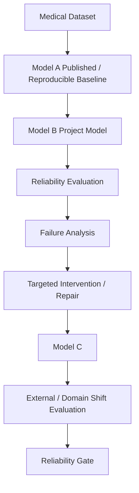

# NeuroShield

NeuroShield is a three track medical AI reliability project focused on neurological imaging. Each track targets a distinct clinical task and dataset, developed independently but following a shared methodology for building and evaluating models.

The project is not only about training models. It follows a reliability oriented workflow involving baseline reproduction, a project selected model, reliability evaluation, systematic failure analysis, targeted repair, a repaired model (Model C), external or domain shift evaluation, and a final reliability assessment.

The three tracks, Alzheimer's disease classification, brain tumor segmentation, and multiple sclerosis lesion segmentation, are developed in parallel and are currently at different stages of this workflow.

## Common Project Flow



This workflow is applied independently to all three tracks while the tracks are developed in parallel.

## Three Track Overview

| Track | Clinical Task | Dataset | Model A | Model B | Current Status |
|---|---|---|---|---|---|
| Track 1 | Alzheimer's disease classification | OASIS | Published / reproducible OASIS classifier | ViT B/16 | Model B complete; Model A remaining |
| Track 2 | Brain tumor segmentation | BraTS 2020 | 2D nnU-Net | UNETR | Model A training completed; checkpoint persistence and outer test evaluation remaining |
| Track 3 | Multiple sclerosis lesion segmentation | MSLesSeg | 3D U-Net reproduction | SegResNet | Model A complete; Model B remaining |

## Datasets

### Track 1: OASIS

- Used for Alzheimer's disease classification
- Fixed subject level train, validation, and test split
- Current split: 164 training, 35 validation, 36 test scans

### Track 2: BraTS 2020

- Brain tumor segmentation dataset
- Four MRI modalities: FLAIR, T1, T1ce, T2
- 368 usable cases after validation
- Fixed split: 257 train, 55 validation, 56 outer test

### Track 3: MSLesSeg

- 75 patients and 115 MRI scans
- Modalities: T1, T2, FLAIR
- Patient level split: 42 train, 11 validation, 22 test patients

## Track 1: Alzheimer's Disease Classification

### Dataset

Fixed split: 164 training, 35 validation, 36 test scans.

### Model A

Model A is the required published or reproducible OASIS classification baseline.

Current status: Remaining.

### Model B: ViT B/16

Completed components:

- 2.5D multi slice MRI input
- ImageNet pretrained ViT B/16
- 12 example overfit sanity test
- Three seeds: 42, 123, 2024
- Scan level held out test evaluation
- Saved results, configuration, and checkpoints

Final Model B results:

| Metric | Value |
|---|---|
| Accuracy | 0.7130 ± 0.0131 |
| Balanced Accuracy | 0.7127 ± 0.0157 |
| Sensitivity | 0.7111 ± 0.0314 |
| Specificity | 0.7143 ± 0.0000 |
| F1 | 0.6734 ± 0.0200 |
| ROC AUC | 0.7386 ± 0.0120 |

### Remaining Work

- Model A
- Reliability / uncertainty evaluation
- Calibration
- OOD / domain shift evaluation
- Failure analysis
- VAE + Latent Diffusion intervention
- Model C
- ADNI external validation
- Final reliability evaluation

## Track 2: Brain Tumor Segmentation

### Dataset

- BraTS 2020
- 368 usable cases
- 257 train, 55 validation, 56 outer test
- FLAIR, T1, T1ce, T2

### Model A: 2D nnU-Net

- nnU-Net v2
- 2D configuration
- Fold 0
- nnUNetTrainer_100epochs
- 100 epochs
- Training completed
- Internal validation mean Dice: 0.765127

Model A training is complete, but the required persistent checkpoint or configuration artifact was not successfully preserved in the first run because the verification stage expected configuration files in the wrong location.

Status:

- Model A training: complete
- Persistent artifact: remaining
- Outer test evaluation: remaining

### Model B

Model B is UNETR. Status: remaining.

### Remaining Work

- Corrected Model A artifact persistence
- Model A outer test inference and evaluation
- Model B (UNETR)
- Reliability / failure analysis
- Model C
- Comparative evaluation

## Track 3: Multiple Sclerosis Lesion Segmentation

### Dataset

- MSLesSeg
- 75 patients
- 115 scans
- T1, T2, FLAIR
- Patient level split: 42 train, 11 validation, 22 test

### Model A: 3D U-Net

- Reproduction of the Shifts 2.0 3D U-Net baseline
- Single model reproduction due to GPU constraints
- Input: T1 + T2 + FLAIR
- Patch size: 112 x 160 x 128
- Seed 42

Results:

| Split | Dice | Precision | Recall |
|---|---|---|---|
| Validation | 0.5639 | 0.4844 | 0.6746 |
| Official Test | 0.3156 | 0.2428 | 0.7236 |

The official Model A checkpoint is preserved using Git LFS.

### Reliability Observation

Poor calibration was observed, with probability outputs saturating near 0 or 1. Calibration has not yet been addressed.

### Model B

Model B is SegResNet. Status: remaining.

### Remaining Work

- SegResNet
- Reliability / stress testing
- Uncertainty
- Calibration
- OOD / domain shift
- Modality intervention / counterfactual testing
- Model disagreement
- Failure Fingerprint
- Model C
- Shift MS evaluation
- Reliability Gate

## Parallel Development Status

| Stage | Track 1: Alzheimer's | Track 2: Brain Tumor | Track 3: MS |
|---|---|---|---|
| Dataset preparation | Complete | Complete | Complete |
| Model A | Remaining | Training complete; persistence / evaluation remaining | Complete |
| Model B | Complete | Remaining | Remaining |
| Reliability evaluation | Remaining | Remaining | Remaining |
| Failure analysis | Remaining | Remaining | Remaining |
| Model C | Remaining | Remaining | Remaining |
| External / domain shift | ADNI remaining | Remaining | Shift MS remaining |
| Reliability Gate | Remaining | Remaining | Remaining |

## Repository Structure

```
Neuroshield/
├── notebooks/
│   ├── alzheimers/
│   ├── braintumor/
│   └── mslesseg/
├── src/
│   ├── alzheimers/
│   ├── braintumor/
│   └── mslesseg/
├── outputs/
│   ├── alzheimers/
│   ├── braintumor/
│   └── mslesseg/
├── .gitignore
├── .gitattributes
└── requirements.txt
```

Large datasets are maintained separately, and large model checkpoints are versioned with Git LFS where required.

## Overall Status

The three tracks are being developed in parallel. Track 1 Model B is complete while Model A remains. Track 2 Model A training is complete, but artifact persistence and outer test evaluation remain. Track 3 Model A is complete and Model B remains. The common reliability, failure analysis, Model C, and external / domain shift stages remain across all three tracks.
